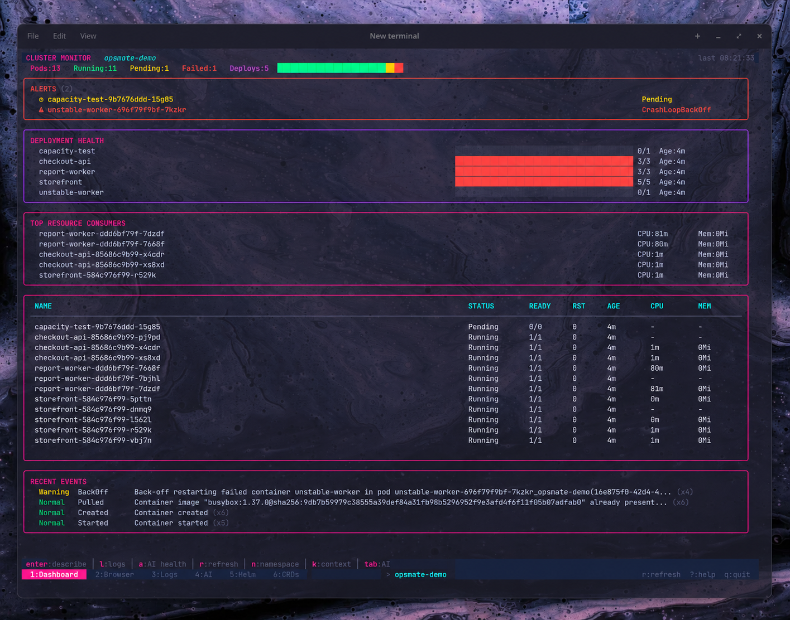

# OpsMate

OpsMate is a terminal UI for Kubernetes. It uses `client-go` with your active kubeconfig and reads Helm releases through the Helm SDK.



## Install

You need Go 1.26.6 or newer and a working kubeconfig.

```sh
go install github.com/HediAbed/opsmate/cmd/opsmate@latest
```

To build from source:

```sh
git clone https://github.com/HediAbed/opsmate.git
cd opsmate
make build
```

## Run

Open the namespace saved from your last session, or all namespaces on the first run:

```sh
opsmate
```

When you build from source, run `./opsmate` instead. Run `opsmate --help` to see the available command options.

## Features

- Check pod status, deployment readiness, restarts, events, CPU, and memory from the dashboard.
- Browse workloads, networking, storage, configuration, RBAC, nodes, namespaces, and events. View descriptions or YAML, filter rows, and switch between standard and wide columns.
- Stream logs from any container. Pause the stream, filter lines, jump between errors, and inspect a selected line.
- Scale workloads, restart rollouts, delete resources, open a pod shell, and forward ports.
- Switch kubeconfig contexts and namespaces without restarting OpsMate.
- Inspect Helm releases and values. Browse CRDs and their resources.
- Send the current screen context to an optional analysis endpoint.

CPU and memory values require the Kubernetes Metrics API. The Helm view requires permission to read Helm release Secrets.

## Optional analysis

Copy the example configuration:

```sh
cp .env.example .env
chmod 600 .env
```

Set the endpoint URL and model:

```dotenv
OPSMATE_PROVIDER_URL=https://provider.example/v1/chat/completions
OPSMATE_PROVIDER_MODEL=your-model
OPSMATE_PROVIDER_API_KEY=replace-with-your-key
```

`OPSMATE_PROVIDER_API_KEY` is optional. Environment variables override values from `.env`.

For Ollama, set `OPSMATE_PROVIDER_URL` to `http://localhost:11434/v1/chat/completions` and `OPSMATE_PROVIDER_MODEL` to the model you pulled.

## Release

The current version is stored in [`VERSION`](VERSION).

## License

[MIT](LICENSE)
